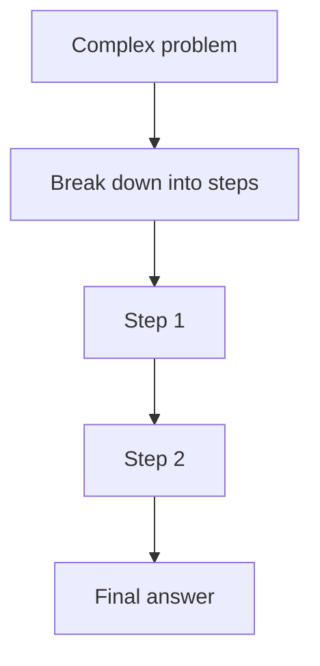
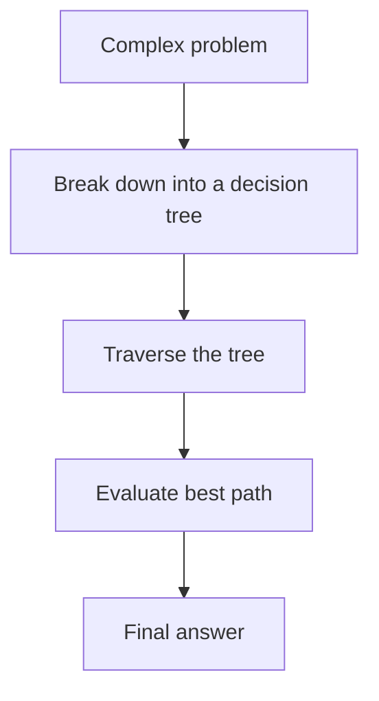
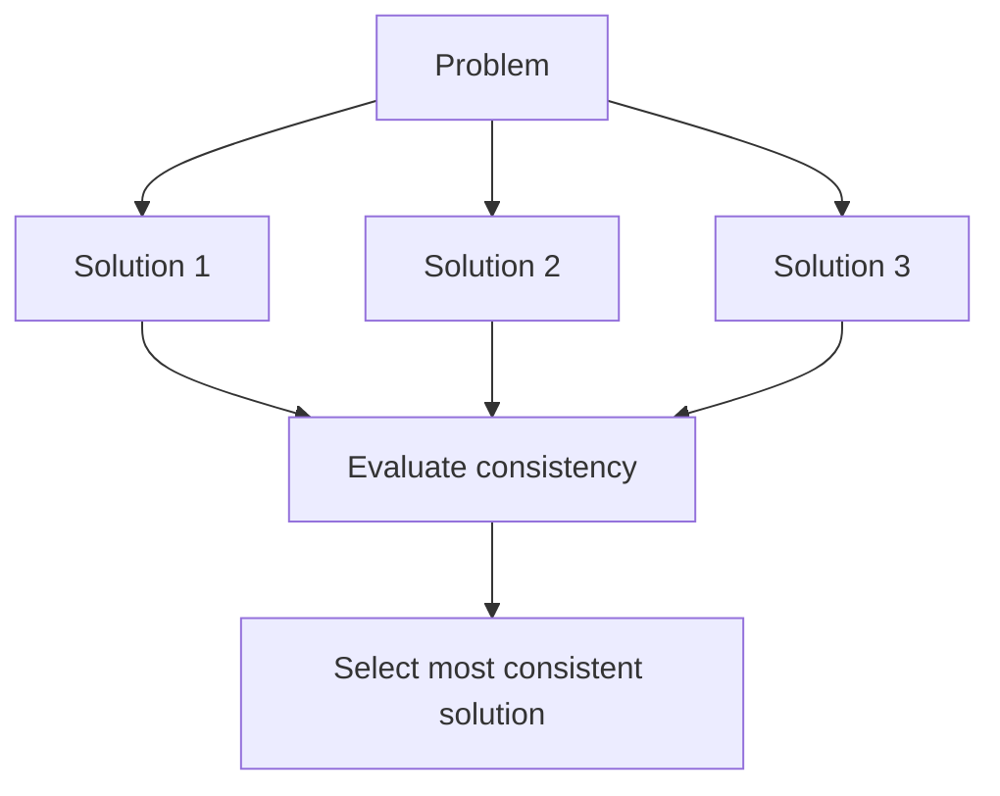
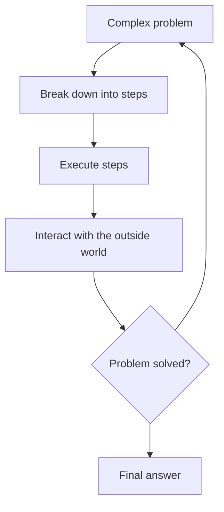

Recently, OpenAI launched [ChatGPT o1](https://openai.com/index/introducing-openai-o1-preview/). A new version of their chatbot that doesn't improve in speed, but in its ability to solve complex problems by **reasoning**, [demonstrating an approach to doctorate-level capabilities](https://openai.com/index/learning-to-reason-with-llms/).

This brings us to phase 2 of OpenAI's 5-phase strategy towards artificial general intelligence (AGI)

1. Chatbots
2. **Reasoners**
3. Agents
4. Innovators
5. Organizations

In this article, we will see in detail how *reasoners* work and take a glimpse at what will follow.

## How do machines reason?

### Type 1 and Type 2 Systems

In the book *Thinking, Fast and Slow*, psychologist and Nobel laureate in Economics Daniel Kahneman presents a theory about the human mind. According to Kahneman, our brain operates through two distinct but complementary processing and decision-making systems.

The type 1 system operates automatically and quickly, with little or no effort and without a sense of voluntary control. Some examples of this system include:

- Completing the phrase "bread and..."
- Answering 2 + 2 = ?
- Driving a car on an empty road

On the other hand, the type 2 system focuses attention on effortful mental activities that demand it, including complex calculations. Operations of this type are often associated with the subjective experience of acting, choosing, and concentrating. Some examples of this system are:

- Verifying the validity of a complex logical argument
- Checking the validity of a complex algebraic equation
- Determining the best move in a chess game

ChatGPT o1 is inspired by the type 2 system, performing a multi-step reasoning process to arrive at an optimal answer, instead of generating an immediate response.

### Chain of Thought

Chain of Thought (CoT) is a technique that involves breaking down complex problems into intermediate steps that the model follows to reach a solution. Like humans, models use this chain of reasoning to tackle difficult tasks such as mathematical problems, symbolic logic, or common sense reasoning.

Chains of thought improve the reasoning of LLMs (large language models) and is similar to how you would make a to-do list to organize your day, breaking down complex activities into smaller steps. Or like a programmer who divides a problem into smaller functions.

CoT guides the model to follow a logical sequence, step by step, towards a solution.

### Tree of Thought

Tree of Thought (ToT) is an extension of the Chain of Thought approach, which breaks down complex problems into multiple reasoning paths, forming a decision tree. Instead of following a single linear chain of steps, ToT explores several possible paths and evaluates which is the best.

### Self-Consistency

Self-Consistency is another technique that generates multiple answers and chooses the most consistent answer among all those generated. The idea is that if several different paths lead to the same solution, there is more confidence that this answer is correct.

## Beyond Reasoners

### Agents

The next phase in AI development is agents, systems that use a language model as a central brain to coordinate complex operations, including planning and use of external tools.

Looking ahead to this phase, we can expect, in addition to improvements in reasoning, interaction with the outside world and initiative.

Imagine an AI assistant that not only explains how to do something, but does it for you:

- Send emails
- Schedule meetings
- Interact with applications on your behalf
- Buy the plane ticket for your vacation

Companies like [Microsoft](https://github.com/microsoft/autogen) are already working on implementations of AI agents.

### Innovators

The next big challenge for AI is the ability to innovate and create original knowledge. While current LLMs are excellent at reasoning about known problems, they still struggle with generating truly novel ideas.

Recent research shows that LLMs only improve when provided with more data and compute, until they reach a point where improvements slow down, following the power law. This means that once training data is exhausted, adding more computing power does not significantly increase their performance.

This implies that LLMs will eventually be replaced or integrated with AI systems capable of "thinking outside the box" and generating new knowledge.

To reach this level, future AI systems will need:

- Ability to abstract and generalize beyond training data
- Ability to combine concepts creatively
- Mechanisms to evaluate and refine ideas

In this sense, we are likely to see new architectures emerge in this direction.

## Conclusions

The advancement of AI from simple chatbots to systems capable of reasoning and potentially innovating marks a paradigm shift in technology.

As we approach AGI, we must consider the ethical implications, regulatory frameworks, and the opportunities and challenges that will arise and permeate the rest of the sciences.

AI is going to drastically transform society. Staying informed and participating in these discussions is key for developers, researchers, and the general public.

## Recommended Readings

- [Chain of Thought Prompting Elicits Reasoning in Large Language Models](https://arxiv.org/abs/2201.11903). Wei et al., 2022.
- [Self-Consistency Improves Chain of Thought Reasoning in Language Models](https://arxiv.org/abs/2203.11171). Wang et al., 2023.
- [Scaling Laws for Neural Language Models](https://arxiv.org/abs/2001.08361). Kaplan et al., 2020
- [Tree of Thoughts: Deliberate Problem Solving with Large Language Models](https://arxiv.org/abs/2305.10601). Shen et al., 2023.