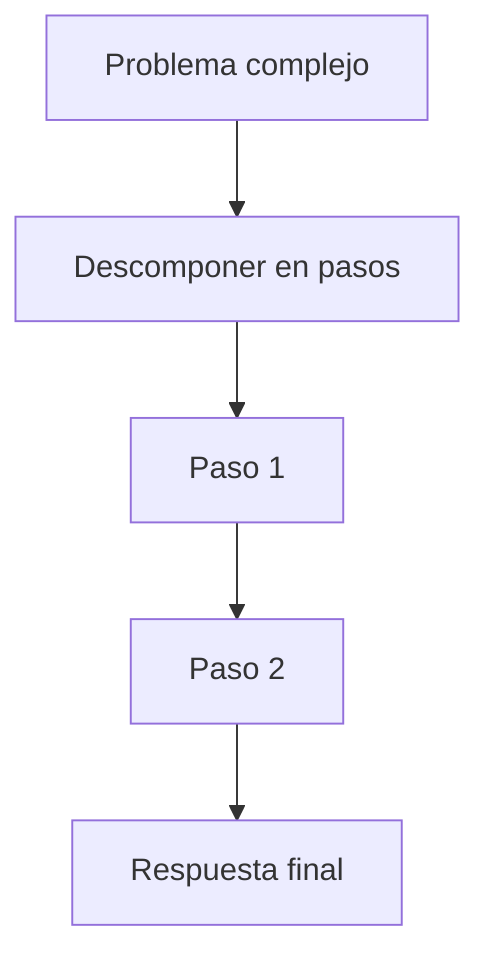
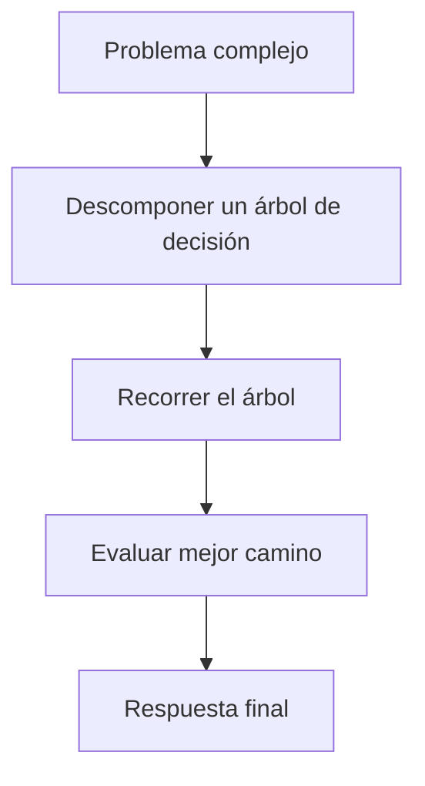
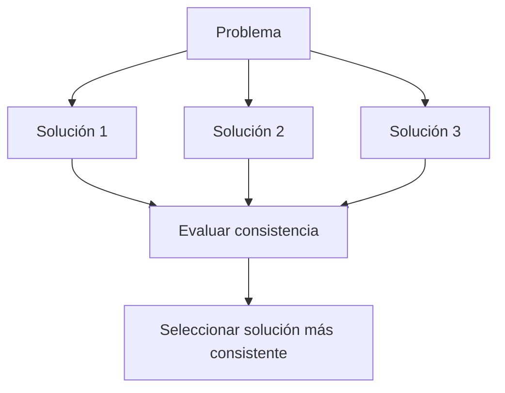
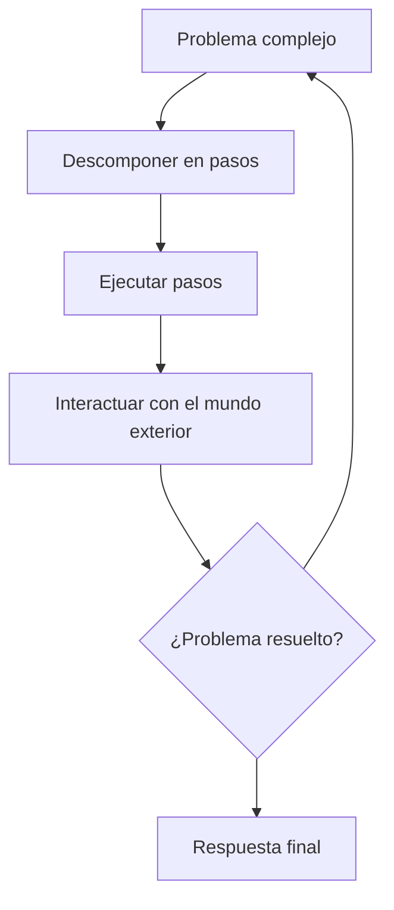

Recientemente OpenAI hizo el lanzamiento de [ChatGPT o1](https://openai.com/index/introducing-openai-o1-preview/). Una nueva versión de su chatbot que no mejora en velocidad, sino su capacidad de resolver problemas complejos **razonando**, [demostrando acercarse al nivel de doctorado](https://openai.com/index/learning-to-reason-with-llms/).

Esto nos lleva a la fase 2 de 5 fases en la estrategia de OpenAI hacia la inteligencia artificial general (AGI)

1. Chatbots
2. **Razonadores**
3. Agentes
4. Innovadores
5. Organizaciones

En este artículo veremos en detalle cómo funcionan los *razonadores* y un vistazo a lo que seguirá después.

## ¿Como razonan las máquinas?

### Sistema tipo 1 y tipo 2

En el libro *Pensar rápido, pensar despacio*, el psicólogo y premio Nobel de Economía Daniel Kahneman presenta una teoría sobre la mente humana. Según Kahneman, nuestro cerebro opera mediante dos sistemas de procesamiento y toma de decisiones distintos pero complementarios. 

El sistema tipo 1 opera de manera automática y rápida, con poco o ningún esfuerzo y sin sensación de control voluntario. Algunos ejemplos de este sistema incluyen:

- Completar la frase "pan y..."
- Responder a 2 + 2 = ?
- Conducir un coche por una carretera vacía

Por otro lado, el sistema tipo 2 centra la atención en las actividades mentales esforzadas que lo demandan, incluidos los cálculos complejos. Las operaciones de este tipo están a menudo asociadas con la experiencia subjetiva de actuar, elegir y concentrarse. Algunos ejemplos de este sistema son:

- Verificar la validez de un argumento lógico complejo
- Comprobar la validez de una ecuación algebraica compleja
- Determinar la mejor jugada en una partida de ajedrez

ChatGPT o1 se inspira en el sistema tipo 2, realizando un proceso de razonamiento en varios pasos para llegar a una respuesta óptima, en lugar de generar una respuesta inmediata.

### Chain of Thought

Chain of Thought (CoT) es una técnica que consiste en descomponer problemas complejos en pasos intermedios que el modelo sigue para llegar a una solución. Al igual que los humanos, los modelos utilizan esta cadena de razonamiento para abordar tareas difíciles como problemas matemáticos, lógica simbólica o razonamiento basado en el sentido común.

Las cadenas de pensamiento mejoran el razonamiento de los LLMs (large language models) y es similar a cómo harías una lista de tareas para organizar tu día, desglosando actividades complejas en pasos más pequeños. O como un programador que divide un problema en funciones más pequeñas.

CoT guía al modelo a seguir una secuencia lógica, paso por paso, hacia una solución.

### Tree of Thought

Tree of Thought (ToT) es una extensión del enfoque Chain of Thought, que descompone problemas complejos en múltiples caminos de razonamiento, formando un árbol de decisiones. En lugar de seguir una única cadena lineal de pasos, ToT explora varios caminos posibles y evalúa cuál es la mejor.

### Self-Consistency

Self-Consistency es otra técnica que genera múltiples respuestas y se elige la respuesta más consistente entre todas las generadas. La idea es que, si varios caminos diferentes llevan a la misma solución, hay más confianza en que esa respuesta es correcta.

## Más allá de los razonadores

### Agentes

La próxima fase en el desarrollo de la IA son los agentes, sistemas que utilizan un modelo de lenguaje como cerebro central para coordinar operaciones complejas, incluyendo planificación y uso de herramientas externas.

De cara a esta fase, podemos esperar, además de mejoras de razonamiento, la interacción con el mundo exterior y la iniciativa.

Imagina un asistente de IA que no solo explica cómo hacer algo, sino que lo hace por usted:

- Enviar correos electrónicos
- Programar reuniones
- Interactuar con aplicaciones en su nombre
- Comprar el boleto de avión para sus vacaciones

Empresas como [Microsoft](https://github.com/microsoft/autogen) ya están trabajando en implementaciones de agentes de IA.

### Innovadores

El siguiente gran desafío para la IA es la capacidad de innovar y crear conocimiento original. Mientras que los LLM actuales son excelentes para razonar sobre problemas conocidos, aún luchan con la generación de ideas verdaderamente novedosas.

Investigaciones recientes muestran que los LLM solo mejoran cuando se les proporciona más datos y cómputo, hasta llegar a un punto donde las mejoras se ralentizan, siguiendo la ley de las potencias. Esto significa que, una vez que se agotan los datos de entrenamiento, añadir más poder de cómputo no incrementa significativamente su rendimiento.

Esto implica que los LLM eventualmente serán reemplazados o integrados con sistemas de IA capaces de "pensar fuera de la caja" y generar conocimiento nuevo.

Para alcanzar este nivel, los futuros sistemas de IA necesitarán:

- Capacidad de abstracción y generalización más allá de los datos de entrenamiento
- Habilidad para combinar conceptos de manera creativa
- Mecanismos para evaluar y refinar ideas

Es importante destacar que el desarrollo de IA innovadoras no se limita a un único enfoque. Mientras que los modelos basados en lenguaje han mostrado un progreso significativo, otros paradigmas como los sistemas cognitivos integrados o los enfoques basados en la evolución también ofrecen caminos prometedores hacia la AGI.

## Conclusiones

El avance de la IA desde simples chatbots hasta sistemas capaces de razonar y potencialmente innovar marca un cambio de paradigma en la tecnología.

A medida que nos acercamos a la AGI, debemos considerar las implicaciones éticas, los marcos, así como las oportunidades y desafíos que aparecerán.

La IA va a transformar drásticamente la sociedad. Mantenerse informado y participar en estas discusiones es clave para desarrolladores, investigadores y el público en general.

## Lecturas recomendadas

- [Artificial General Intelligence: Concept, State of the Art, and Future Prospects](https://sciendo.com/article/10.2478/jagi-2014-0001). Ben Goertzel, 2014.
- [Chain of Thought Prompting Elicits Reasoning in Large Language Models](https://arxiv.org/abs/2201.11903). Wei et al., 2022.
- [Self-Consistency Improves Chain of Thought Reasoning in Language Models](https://arxiv.org/abs/2203.11171). Wang et al., 2023.
- [Scaling Laws for Neural Language Models](https://arxiv.org/abs/2001.08361). Kaplan et al., 2020
- [Tree of Thoughts: Deliberate Problem Solving with Large Language Models](https://arxiv.org/abs/2305.10601). Shen et al., 2023.