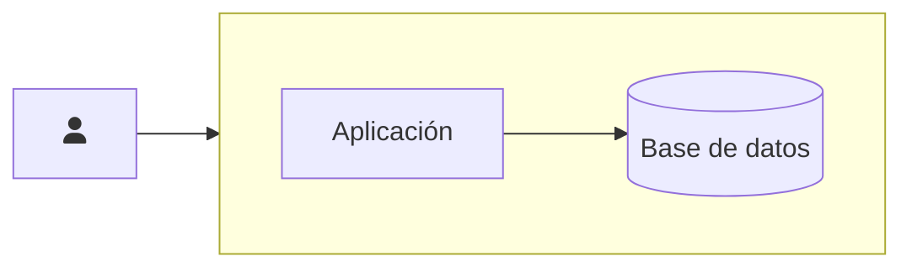
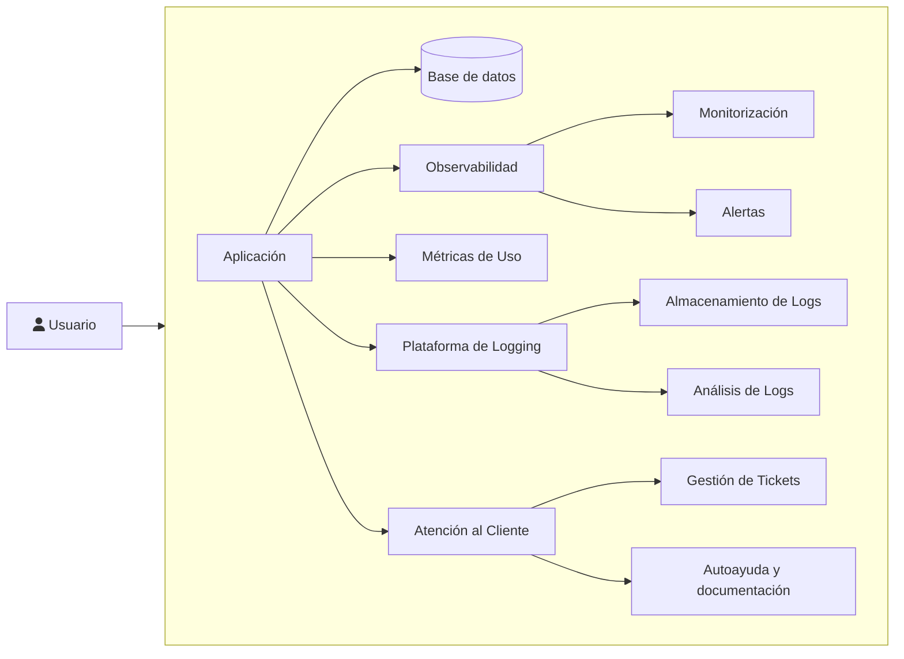

Lanzar un SaaS (Software como Servicio) es una aventura emocionante que combina innovación, estrategia y tecnología.

Si estás pensando en adentrarte en este mundo, ya sea como emprendedor, desarrollador o indie hacker, es posible que tu idea de una SaaS se vea así.

Se encuentran artículos como [Como construir un SaaS en un fin de semana](https://arunas.dev/how-to-build-a-saas-in-a-weekend/) o incluso [Cómo construir tu SaaS en 24 horas](https://marclou.beehiiv.com/p/how-to-build-a-startup-in-24-hours). Si bien es valioso pensar en validar rápido qué tiene tracción, es una ingenua, y mala, idea simplificar la construcción de una SaaS.

Ya tengo algunos años trabajando en SaaS, por lo cual quiero compartirte algunos aprendizajes que tuve en el camino y, tal vez, te ayuden en tu camino emprededor.

## La Velocidad No Siempre es Sinónimo de Éxito

Es común sentirse tentado por la idea de lanzar un producto rápidamente, siguiendo el ejemplo de algunos indie hackers que crean proyectos en un fin de semana. Sin embargo, si aspiras a desarrollar un SaaS sólido y duradero, la planificación y la estrategia son esenciales. Tómate el tiempo para definir claramente:

- Qué producto quieres crear.
- Quién es tu público objetivo.
- Cómo validarás tus ideas basándote en datos reales.

Una visión clara y una ejecución bien diseñada no deben apresurarse. Este enfoque te ahorrará tiempo y recursos a largo plazo. En lugar de construir un producto de forma rápida para validarlo, puedes validar utilizando otros tipos de producto mínimo viable (MVP) o haciendo un estudio de mercado.

El producto mínimo viable [Smoke Test](https://www.fabrizioscoglio.com/prueba-de-humo/) se basa en vender el producto antes de construirlo, para validar si existen personas interesadas en comprarlo. De esta manera, puedes probar tu idea de SaaS sin necesidad de crearla, y modificar la oferta con base en los resultados del mercado.

Una vez que tienes clara tu visión y validaste tu idea, puedes comenzar a construir, no antes.

## Construye con las Herramientas Adecuadas para Crecer

Las plataformas nocode como [Webflow](https://webflow.com/) o [Bubble](https://bubble.io/) son excelentes para iniciar y validar ideas rápidamente, especialmente si no tienes habilidades de programación.

Sin embargo, a medida que tu SaaS crece, los costos y las limitaciones de estas herramientas pueden afectar tu rentabilidad y flexibilidad. Por este motivo incorporar talento técnico a tu equipo o aprender habilidades de programación es clave para un producto SaaS.

Si aún estás en fase de validación, herramientas como [Supabase](https://supabase.com/) o [Firebase](https://firebase.google.com/) un buen balance entre flexibilidad y control. Además, puedes aprovechar soluciones de código abierto como [Form.io](https://form.io/), [Nocodb](https://nocodb.com/), [Appsmith](https://www.appsmith.com/) o [N8N](https://n8n.io/). Este tipo de herramientas, son más baratas de mantener y migrar en un futuro.

## Selecciona la Infraestructura Correcta desde el Inicio

La elección de la arquitectura y la infraestructura es una decisión crítica que impactará en el rendimiento y los costos de tu SaaS.

Haz proyecciones realistas sobre el número de usuarios que esperas en el próximo año. Si no es posible hacerlo, establece un criterio mínimo de éxito para tu negocio en un tiempo determinado.

Un buen criterio de éxito debe ser realista respecto del tamaño del mercado y el capital invertido en el negocio.

Para pequeñas escalas (menos de 10,000 usuarios activos mensuales): Las soluciones serverless como [Vercel](https://vercel.com/home), [AWS Lambda](https://aws.amazon.com/es/pm/lambda) y [Amplify](https://aws.amazon.com/es/amplify/) son económicas y fáciles de implementar, pagando solo por uso y facilitando la escalabilidad sin necesidad de infraestructura dedicada.

Para escalas medianas (10,000 a 100,000 usuarios activos mensuales): Plataformas como servicio, como [App Platform](https://docs.digitalocean.com/products/app-platform/) o [Elastic Beanstalk](https://aws.amazon.com/es/elasticbeanstalk), pueden mantener los costos controlados.

Para grandes escalas (más de 100,000 usuarios activos mensuales): Las soluciones de infraestructura como servicio (IaaS) te dan control total sobre la infraestructura. Esto requiere un equipo especializado para manejar y optimizar servidores, escalabilidad automática y resiliencia en todas las capas del sistema.

Tomar decisiones informadas desde el principio te evitará migraciones costosas y tiempos de inactividad en el futuro.

## Prioriza una Experiencia de Usuario Sólida

Un SaaS exitoso no se trata sólo de ofrecer una aplicacion funcional a los clientes; para ofrecer una experiencia de usuario excepcional, necesitarás observar el rendimiento del producto para mejorarlo y ajustarlo contínuamente.

Monitorización Constante: para tener observabilidad del funcionamiento de la aplicación y establecer alertas por funcionamiento inadecuado, utiliza herramientas como [Newrelic](https://newrelic.com), [Sentry](https://sentry.io/) o alternativas de código abierto como [Prometheus](https://prometheus.io/), [Grafana](https://grafana.com/) y [ELK](https://www.elastic.co/es/elastic-stack).

Analíticas de uso: para entender el comportamiento los usuarios y tener insights puedes aprovechar [Amplitude](https://amplitude.com/) o [Posthog](https://posthog.com/). Esta última opción, además se puede integrar con tu base de datos para tener una visión sólida y completa de tu producto.

Esto además te permitirá tomar una posición proactiva, al solucionar errores antes de que afecten a tus usuarios y mejorar su experiencia con base en datos.

Recuerda que una mala experiencia puede alejar a tus primeros clientes, por lo que es crucial ofrecer calidad desde el día uno.

## Prepárate con Planes de Contingencia

Los errores y fallos son inevitables, pero la respuesta ante ellos marca la diferencia.

Diseña procesos para comunicar y resolver incidentes en la aplicación, priorizando la confianza y la rapidez. Deja este canal de comunicación claro desde el principio: si es chat en tiempo real, correo electrónico o un formulario en la web.

Para manejar la atención al cliente puedes usar Zendesk o alternativas open source más económicas como [Peppermint](https://peppermint.sh/).

En este sentido, el sistema debe contar con herramientas para auditar y observar los hechos ocurridos en producción. Por un lado, en tu solución de monitoreo tener logs es crucial y por otro, la arquitectura debe ser diseñada para permitir una auditoría acorde al caso de uso.

Por último, si una de las características de tu SaaS es la disponibilidad, considera tener una página de status donde comunicas a tus clientes el estado del servicio y los incidentes ocurridos en tiempo real. Para esto hay soluciones de código abierto como [Upptime](https://upptime.js.org/).

## Conclusión

Desarrollar y lanzar un SaaS es un desafío que va más allá de construir un producto funcional rápidamente.

Requiere un equilibrio entre una ejecución cuidadosa, un enfoque estratégico y el uso eficiente de herramientas e infraestructura. Por este motivo, tu idea de SaaS debe verse así

Al centrarte en una planificación sólida y en ofrecer la mejor experiencia posible al usuario, estarás sentando las bases para el éxito de tu producto.

Toma mucho más que un fin de semana crear un SaaS.

Pero si lo construyes por las razones correctas, como ayudar a tu segmento de mercado que te importa a conseguir un resultado deseado.

Te aseguro que valdrá la pena.
