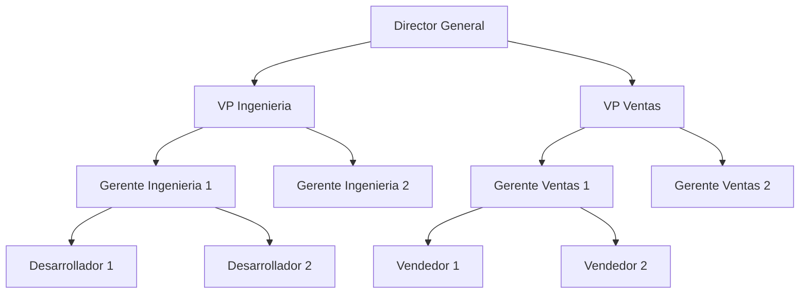
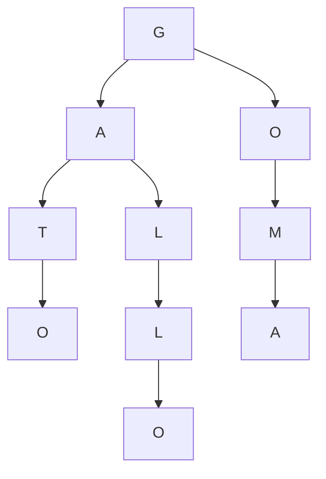

La estructura de datos Trie es una herramienta fundamental en la computación moderna. Se usa para la búsqueda eficiente de palabras, autocompletado, corrección ortográfica y almacenamiento de diccionarios.

## Arboles

Para entender los Tries, primero debemos repasar los árboles, una de las estructuras más utilizadas en la informática. Un árbol es una estructura jerárquica en la que cada nodo puede tener múltiples hijos.

Un ejemplo intuitivo de un árbol es el organigrama de una empresa.

Los árboles sirven para modelar muchos problemas en la computación, este artículo hablará de un tipo de árbol particular llamado Trie.

## ¿Qué es un Trie?

Un Trie (también llamado árbol de prefijos o radix tree) es una estructura de datos en forma de árbol donde cada nodo representa un carácter de una palabra.

Al recorrer el Trie desde la raíz hasta un nodo hoja, se puede reconstruir una palabra completa. Cada nivel del Trie representa una letra en la secuencia de una palabra, lo que lo hace útil para aplicaciones de búsqueda y procesamiento de texto.

## Autocompletado

El autocompletado es una funcionalidad común en aplicaciones modernas. Una forma intuitiva de implementarla es tener una lista de palabras y comparar el prefijo introducido por el usuario con cada palabra de la lista.

Este enfoque tiene un problema: si el diccionario es muy grande, la búsqueda puede ser muy lenta.

El Trie es ideal para autocompletado porque almacena palabras de manera jerárquica, permitiendo encontrar rápidamente todas las palabras que comienzan con un prefijo dado.

Cuando un usuario escribe las primeras letras de una palabra, el Trie puede recorrer la estructura hasta el nodo correspondiente y devolver todas las posibles continuaciones sin necesidad de recorrer todo el diccionario.

  <input 
    type="text" 
    id="trieInput" 
    placeholder="Escribe para ver el Trie..."
    class="w-full p-2 border rounded"
  />
  

    <ul id="suggestionsList"></ul>
  

  

## Corrección ortográfica

## Diccionarios

