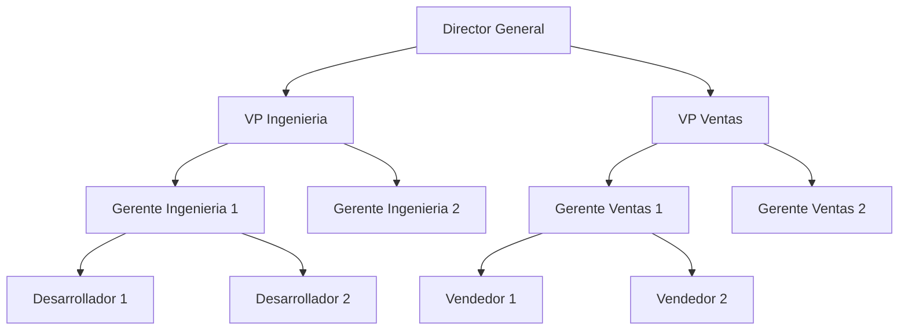
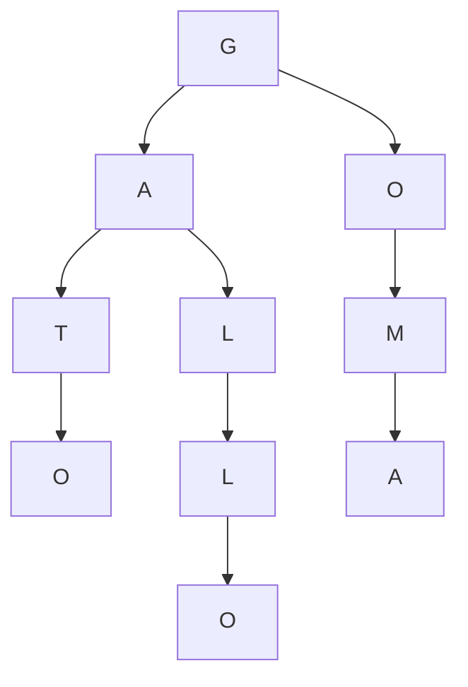

Las estructuras de datos son uno de los pilares fundamentales detrás de las funciones de autocompletado que usamos todos los días. 

¿Te has preguntado alguna vez cómo Google puede sugerir búsquedas tan rápidamente mientras escribes?

¿O cómo tu editor de código puede autocompletar variables y funciones en milisegundos?

La respuesta está en esta elegante estructura de datos que vamos a explorar hoy, los **Tries**.

Los Tries están detrás de muchas de las funciones que usamos todos los días, como:

- Motores de búsqueda
- Editores de código
- Correctores ortográficos
- Routers de red
- Sistemas de archivos
- Procesamiento de lenguaje natural

## Arboles

Para entender los Tries, primero debemos repasar los árboles, una de las estructuras centrales en la informática. Un árbol es una estructura jerárquica en la que cada nodo puede tener múltiples hijos.

Un ejemplo intuitivo de un árbol es el organigrama de una empresa.

Los árboles sirven para modelar muchos problemas en la computación, y se encuentra en todos lados, el Trie es una estructura de datos basada en árboles y permite modelar palabras.

### Conceptos clave

- Nodo: Un nodo es un punto en el árbol.
- Raíz: El nodo superior de un árbol.
- Hoja: Un nodo sin hijos.

## Búsqueda en profundidad

El algoritmo de búsqueda en profundidad (DFS) es un algoritmo de búsqueda que recorre un árbol (o grafo) desde un nodo inicial, explorando cada rama lo más profundo posible antes de retroceder.

En el siguiente ejemplo, puedes ver el recorrido de un árbol usando DFS, dale click al botón para ver la animación.

<!-- Animacion de recorrido de árbol -->
<button id="dfsButton" style="padding: 8px 16px; background-color: #4a90e2; color: white; border: none; border-radius: 4px; cursor: pointer; font-size: 14px; margin: 10px 0;">Iniciar recorrido</button>

  

## ¿Qué es un Trie?

Un Trie (también llamado árbol de prefijos o radix tree) es una estructura de datos en forma de árbol donde cada nodo representa un carácter de una palabra.

Al recorrer el Trie desde la raíz hasta un nodo hoja, se puede reconstruir una palabra completa. Cada nivel del Trie representa una letra en la secuencia de una palabra.

Los Tries son muy eficientes para almacenar y buscar palabras. En muchos casos, tienen ventajas frente a las tablas de hash, ya que no tienen colisiones ni requieren una función hash, especialmente en la búsqueda por prefijo.

Mientras que una tabla de hash permite búsquedas exactas en tiempo promedio $ O(1) $, un Trie ofrece una complejidad de $ O(k) $ donde $ k $ es la longitud de la palabra.

Aunque esto puede ser menos eficiente para búsquedas exactas, es mucho más rápido cuando se necesitan búsquedas por prefijo o sugerencias de autocompletado.

## Complejidad y Rendimiento

La complejidad del Trie para las principales operaciones es:

| Operación | Complejidad |
|-----------|-------------|
| Inserción | O(k) |
| Búsqueda exacta | O(k) |
| Espacio | O(N * K) |

Donde:
- N es el número de palabras en el Trie
- K es la longitud promedio de las palabras
- k es la longitud de una palabra

## Autocompletado

El autocompletado es una funcionalidad común en aplicaciones modernas. Una forma intuitiva de implementarla es tener una lista de palabras y comparar el prefijo introducido por el usuario con cada palabra de la lista.

Este enfoque tiene un problema: si el diccionario es muy grande, la búsqueda puede ser muy lenta.

El Trie es ideal para autocompletado porque almacena palabras de manera jerárquica, permitiendo encontrar rápidamente todas las palabras que comienzan con un prefijo dado.

Cuando un usuario escribe las primeras letras de una palabra, el Trie puede recorrer la estructura hasta el nodo correspondiente y devolver todas las posibles continuaciones sin necesidad de recorrer todo el diccionario.

En el siguiente ejemplo interactivo, puedes ver el recorrido del Trie mientras escribes y ver las sugerencias que se van generando.

Para mantenerlo simple, el diccionario contiene solo 10 palabras.

  <input 
    type="text" 
    id="trieInput" 
    placeholder="Escribe para ver el Trie..."
    class="w-full p-2 border rounded"
  />
  

  

  

Veamos un ejemplo interactivo con más palabras, el siguiente diccionario contiene casi 200 animales.

  <input 
    type="text" 
    id="autocompleteInput"
    placeholder="Escribe el nombre de un animal..."
    style="width: 100%;"
  />
  

## Corrección ortográfica

Los Tries son especialmente buenos para almacenar diccionarios de palabras. Una aplicación común es la corrección ortográfica. Cuando un usuario escribe una palabra incorrectamente, podemos usar la estructura de datos para mantener de forma eficiente un diccionario de palabras y sugerir palabras similares.

El proceso implica:

1. Calcular la "distancia" entre la palabra mal escrita y cada palabra en el diccionario.

2. Sugerir las palabras con menor distancia.

La distancia que vamos a usar es la [distancia de *Levenshtein*](https://es.wikipedia.org/wiki/Distancia_de_Levenshtein), una medida que cuenta el número mínimo de operaciones necesarias para transformar una palabra en otra.

En el siguiente ejemplo, vamos a usar un Trie para almacenar un diccionario de animales y sugiere palabras similares mientras escribes.

El gráfico muestra las 10 palabras más similares usando la distancia de Levenshtein.

  <input 
    type="text" 
    id="spellCheckInput" 
    placeholder="Escribe el nombre de un animal..."
    class="w-full p-2 border rounded"
  />
  

## Conclusión

El Trie es una estructura de datos poderosa y eficiente para el procesamiento de texto, utilizada en aplicaciones como autocompletado, búsqueda por prefijo y corrección ortográfica.

Su diseño basado en árboles permite organizar información de manera jerárquica, optimizando búsquedas sin necesidad de funciones hash o resolución de colisiones.

El Trie es una muestra de la versatilidad de los árboles en la informática, demostrando cómo pueden adaptarse a distintos problemas de manera eficiente.

Si este artículo te fue útil, considera implementarlo en tus propios proyectos y compártelo con tus amigos y compañeros de trabajo para que puedan aprender más sobre las estructuras de datos.