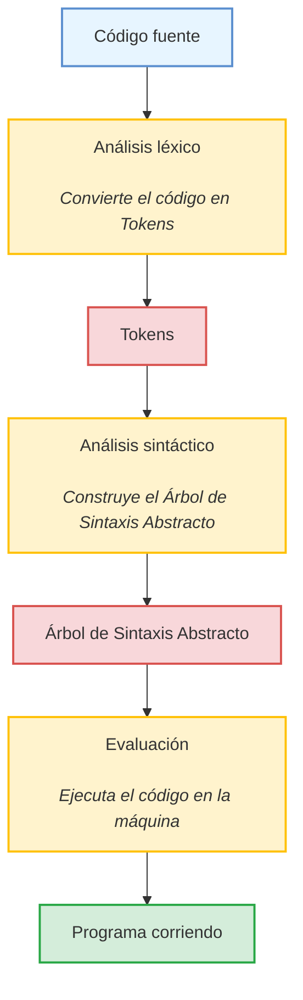

Al aprender programación, comenzamos a apreciar como funcionan las aplicaciones. Desde páginas web, aplicaciones móviles o de escritorio, todo comienza a cobrar sentido.

Es por esto que, si eres programador o programadora, seguramente te has preguntado como funciona Javascript, Python o tu lenguaje favorito.

¿Como es que una secuencia de caracteres en un simple archivo de texto se transforma en instrucciones para una maquina?

¿Cómo se hacen los programas para hacer programas?

En este artículo voy a responder esta interrogante y, si no has estudiado el tema tal vez parezca imposible, pero si tenemos suerte terminarás este artículo con ganas de hacer tu propio lenguaje de programación.

Y con los recursos como para hacerlo.

## Breve historia de los lenguajes de programación

El procesador de una computadora entiende lenguaje máquina, literalmente instrucciones que se escriben en unos y ceros. En un inicio, los programadores usaban este lenguaje en su trabajo, en la década de 1940, en ese momento las computadoras ocupaban varias habitaciones y pesaban toneladas.

Así luce un programa en código máquina, expresado en hexadecimal. ¿Sabrías descifrar qué hace?

```
b8 04 00 00 00       ; mov eax, 4 (sys_write)
bb 01 00 00 00       ; mov ebx, 1 (stdout)
b9 2c 00 00 00       ; mov ecx, msg (offset del mensaje)
ba 0a 00 00 00       ; mov edx, len (longitud del mensaje)
cd 80                ; int 0x80 (syscall)

b8 01 00 00 00       ; mov eax, 1 (sys_exit)
31 db                ; xor ebx, ebx (exit code 0)
cd 80                ; int 0x80 (syscall)

; Mensaje (sección de datos)
48 6f 6c 61 20 4d 75 6e 64 6f 0a
```

Las personas comenzaron a escribir programas con complejidad creciente e incorporaron el lenguaje ensamblador, un lenguaje muy cercano al código de máquina pero que emplea palabras y acrónimos fáciles de recordar para las instrucciones.

```
section .data
    msg db "Hola Mundo", 0x0A ; Mensaje a imprimir con salto de línea
    len equ $ - msg           ; Longitud del mensaje

section .text
    global _start             ; Punto de entrada

_start:
    ; Llamada al sistema write (syscall 1)
    mov eax, 4                ; Código del syscall para write
    mov ebx, 1                ; Descriptor de archivo (1 = stdout)
    mov ecx, msg              ; Dirección del mensaje
    mov edx, len              ; Longitud del mensaje
    int 0x80                  ; Interrupción para realizar el syscall

    ; Llamada al sistema exit (syscall 60)
    mov eax, 1                ; Código del syscall para exit
    xor ebx, ebx              ; Código de salida (0)
    int 0x80                  ; Interrupción para realizar el syscall

```

En ambos casos, el lenguaje depende de la máquina en cuestión. Cada instrucción tiene un código en binario diferente y las instrucciones permitidas varían en los procesadores.

A finales de la década del 1950 se materializa el esfuerzo por crear lenguajes de programación con el poder de expresar lógica y expresiones aritméticas de una forma más humana y que puedan llevarse a distintas plataformas.

Estos lenguajes más cercanos al lenguaje natural les llamamos lenguajes de alto nivel, mientras que el ensamblador o el código de máquina, de bajo nivel. Una de las personas pioneras que dio inicio a esta era de lenguajes de programación fue Grace Hopper, quién trabajó en el primer compilador de la historia: el primer programa para programar programas.

<iframe width="560" height="315" src="https://www.youtube.com/embed/1LR6NPpFxw4?si=CbSwnrUPJoMbVYCL" title="YouTube video player" frameborder="0" allow="accelerometer; autoplay; clipboard-write; encrypted-media; gyroscope; picture-in-picture; web-share" referrerpolicy="strict-origin-when-cross-origin" allowfullscreen></iframe>

## Técnicas de implementación

Los lenguajes de programación se suele categorizar en interpretados y compilados.

La compilación es la forma más clásica de crear un lenguaje de programación. Un compilador es un programa que traduce código en lenguaje de alto nivel a código en un lenguaje de bajo nivel.

La interpretación por otro lado es un camino más moderno. En esencia, un interprete decodifica un programa en un lenguaje de alto nivel y lo ejecuta.

Esta categorización es una simplificación de la realidad. Hay un espectro entre entre lenguajes puramente compilados y lenguajes interpretados.

Lenguajes de programación como C o Go son compilados a binario antes de ser ejecutados. Por supuesto, hay lenguajes como Ruby (previo a la versión 1.9) que son puramente interpretados. 

Sin embargo, entre estos dos extremos existen matices. Hay lenguajes interpretados que se compilan a *Bytecode* para una *máquina virtual*, como lo es Python y Java.

Además, en el caso de Java, hay una segunda compilación llamada *compilación en tiempo de ejecución*, que transforma el *Bytecode* a binario.

<iframe width="560" height="315" src="https://www.youtube.com/embed/d7KHAVaX_Rs?si=F96qU2SZ50IuJA5L&amp;start=60" title="YouTube video player" frameborder="0" allow="accelerometer; autoplay; clipboard-write; encrypted-media; gyroscope; picture-in-picture; web-share" referrerpolicy="strict-origin-when-cross-origin" allowfullscreen></iframe>

La implementación de un lenguaje de programación pasa por dos etapas. La primera fase toma el código fuente y los transforma en una representación de más alto nivel y devela la intención del programador. Posteriormente, la segunda fase toma la representación rica en contexto y la lleva hasta la máquina para que lo ejecute.

Robert Nystrom tiene excelente ilustración de los caminos para implementar un lenguaje de programación, si te interesa tener más información del panorama general te recomiendo su artículo [Mapa del territorio](https://craftinginterpreters.com/a-map-of-the-territory.html).

Para mantener este artículo práctico y accesible para programadores sin experiencia, nos vamos a centrar en la implementación un intérprete de tipo *Tree-Walker*, la misma estrategia que usaba Ruby en sus inicios.
## Estructura de un intérprete tipo _Tree-Walker_

Implementaremos un intérprete sencillo al estilo Ruby en sus versiones iniciales. Nuestro proceso se reparte en tres pasos:

1. **Análisis léxico**: Convierte el código fuente en una lista de tokens.
2. **Análisis sintáctico**: Construye un árbol de sintaxis abstracto (AST) a partir de esos tokens.
3. **Evaluación**: Recorre el AST para ejecutar las instrucciones en la máquina.



## Definiendo el lenguaje

Los lenguajes formales se especifican con gramáticas, donde se definen reglas y símbolos. Estos lenguajes evitan ambigüedades, algo imprescindible para que las computadoras reconozcan cada instrucción sin confusiones.

Por ejemplo, JSON tiene una gramática clara. Al detectar un `{`, `}` o `:`, podemos verificar si la cadena sigue las reglas de la sintaxis JSON. Con cualquier lenguaje ocurre lo mismo, solo que con mayor complejidad y más construcciones (funciones, clases, estructuras de control, etc.).

Así luce la gramática de JSON

```
<json>         → <object> | <array>

<object>       → "{" <members> "}" | "{}"
<members>      → <pair> ("," <pair>)*
<pair>         → <string> ":" <value>

<array>        → "[" <elements> "]" | "[]"
<elements>     → <value> ("," <value>)*

<value>        → <string> 
               | <integer>
               | <object>
               | <array>
               | "true" 
               | "false" 
               | "null"

<string>       → "\"" <characters> "\""
<characters>   → <character>*
<character>    → cualquier carácter Unicode excepto comillas dobles ("), barra invertida (\) o caracteres de control.

<integer>      → "-"? <digits>
<digits>       → "0" | [1-9] [0-9]*
```

Para este ejemplo, definimos un lenguaje tipo Python, llamado "Culebra", donde un programa es una secuencia de sentencias (asignaciones o expresiones). Algunas partes de la gramática se ven así:

```
<program>       → <statement>*
<statement>     → <assignment>
                | <expression>

<assignment>    → <identifier> "=" <expression>

<expression>    → <literal>
                | <identifier>
                | <binary_operation>
                | <function_call>

<binary_operation> → <expression> <operator> <expression>

<function_call> → <identifier> "(" <arguments>? ")"

<arguments>     → <expression> ("," <expression>)*

<literal>       → <string> | <integer> | <boolean> | "None"

<identifier>    → <letter> <alphanumeric>*

<string>        → "\"" <characters> "\""
<characters>    → <character>*
<character>     → cualquier carácter Unicode excepto comillas dobles ("), barra invertida (\) o caracteres de control.

<integer>       → "-"? <digits>
<digits>        → "0" | [1-9] [0-9]*

<boolean>       → "True" | "False"

<operator>      → "+" | "-" | "*" | "/" | "%" | "==" | "!=" | "<" | ">" | "<=" | ">="

<letter>        → [a-zA-Z_]
<alphanumeric>  → <letter> | [0-9]
```

## Análisis léxico

El _lexer_ recorre el código y separa las partes mínimas significativas, llamados tokens. Por ejemplo, en `x = 1`, reconocemos:

- `x` como `<identifier>`
    
- `=` como `<equal>`
    
- `1` como `<integer>`

El algoritmo para tokenizar lee el código fuente carácter por carácter, identificando los tokens terminales mediante expresiones regulares.

En este ejemplo:

- El identificador comienza por una letra y sigue de caracteres alfanuméricos y guión bajo
- Los enteros comienzan por un dígito del 1 al 9 y pueden seguir de otros dígitos.

```
<identifier>   → "[a-zA-Z][a-zA-Z0-9_]"
<integer>      → "[1-9][0-9]*"
<equal>        → "="
```
## Análisis sintáctico

El _parser_ recibe la lista de tokens y construye el árbol de sintaxis abstracto. Si parseamos `x = 1 + 1 * 2`, formamos un nodo de asignación con la variable `x`, y una operación de suma que internamente tiene una operación de multiplicación.

Para esto, la secuencia de tokens y construir una representación más precisa de nuestro lenguaje de programación. Este programa se conoce como parser. 

Tomemos el mismo ejemplo simple anterior.

```
<identifier> = <integer>
```

Este programa transformará la secuencia de tokens en lo que llamamos un árbol de sintaxis abstracto.

```
├── Program
    ├── Assignment
        └──Identifier(a)
        └──Integer(1)
```

Esta representación del código mantiene una estructura semántica más fiel a la gramática. 

Veamos otro ejemplo:

```
print("Hola, mundo!")
```

Es transformado a:

```
├── Program
    ├── FunctionCall(Identifier(print))
            └──String("Hola, mundo!")

```

Hay varias formas de lograrlo, pero la más fácil de implementar es el algoritmo de descenso recursivo. En este algoritmo se procesan los tokens uno a uno, y mediante funciones recursivas basadas en la gramática se obtiene el árbol de sintaxis.

## Evaluación

Por último, un _Tree-Walker_ recorre el AST y va "resolviendo" cada nodo, mediante el algoritmo de descenso en profundidad.

Una asignación evalúa la expresión y la guarda en una tabla de símbolos. Una operación de suma evalúa ambos operandos y los suma. Con este enfoque ya tenemos un lenguaje funcional, aunque sea sencillo.

## Conclusiones

Este recorrido muestra el paso de código fuente a ejecución, y da una idea clara de cómo se "fabrican" los lenguajes. Con un intérprete básico, podemos implementar funciones, bucles y tipos complejos si avanzamos un poco más en la gramática y la evaluación. Incluso podríamos construir un compilador que genere binarios optimizados, pero esa es otra historia (que contaré en otro post).

Si quieres ver una demostración práctica de este lenguaje en funcionamiento, te invito a ver mi video en YouTube donde explico en detalle lo tratado en este artículo y muestro una demo en vivo: [Ver video](https://www.youtube.com/watch?v=SurgZTML5Ow).

Además, puedes revisar el código fuente en GitHub, donde encontrarás una gran cantidad de comentarios didácticos que explican el funcionamiento interno del intérprete: [Ver código en GitHub](https://github.com/cdgn-coding/culebra).

En futuras entregas abordaré los sistemas de tipos y la generación de código binario.

## Recursos

- [Crafting Interpreters](https://craftinginterpreters.com/)
- [Create your own awesome programming language](http://createyourproglang.com/)
- [Compilers: Principles, Techniques, and Tools](https://www.amazon.com/Compilers-Principles-Techniques-Tools-2nd/dp/0321486811)
- [Programming Language Pragmatics](https://www.amazon.com/Programming-Language-Pragmatics-Michael-Scott/dp/0124104096)