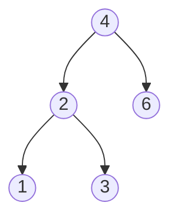
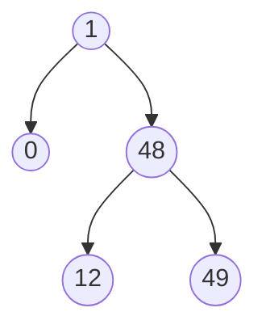

# Diferencia Mínima en un Árbol Binario de Búsqueda

## Descripción

Dado el nodo raíz de un Árbol Binario de Búsqueda (BST), devuelve la diferencia absoluta mínima entre los valores de cualquier par de nodos diferentes en el árbol.

**Ejemplo 1:**

La diferencia mínima es 1

**Ejemplo 2:**

La diferencia mínima es 1

## Solución

Para resolver este problema, podemos realizar un recorrido en orden del árbol.

Como sabemos que este recorrido visita los nodos en orden ascendente, podemos mantener un seguimiento del valor del nodo anterior y calcular la diferencia con el nodo actual en cada paso.

Aquí hay un esquema de la solución:

1. Inicializar una variable para almacenar la diferencia mínima y otra para el valor del nodo anterior.
2. Realizar un recorrido en orden del BST.
3. En cada nodo, calcular la diferencia con el valor anterior (si existe).
4. Actualizar la diferencia mínima si la diferencia actual es menor.
5. Actualizar el valor anterior al valor actual.
6. Repetir para todos los nodos.
7. Devolver la diferencia mínima encontrada.

## Enlaces

- [Solución en GitHub](https://github.com/cdgn-coding/leetcode-practice-guide/tree/main/binary_search_tree/min_diff)
- [Problema en LeetCode](https://leetcode.com/problems/minimum-absolute-difference-in-bst/solutions/3636629/python-simple-and-clean-beats-66-67/?envType=study-plan-v2&envId=top-interview-150)