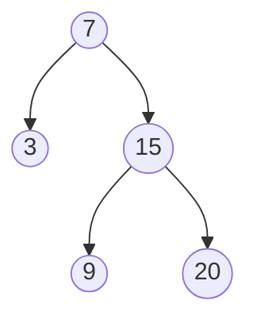

## Descripción

Implementa una clase `BSTIterator` que permita recorrer un árbol binario de búsqueda (BST) en orden. La clase debe tener los siguientes métodos:

- `BSTIterator(TreeNode root)`: Constructor que inicializa el iterador.

- `boolean hasNext()`: Devuelve `true` si hay más elementos por recorrer.

- `int next()`: Devuelve el siguiente elemento en el recorrido en orden.

Ejemplo de BST:

## Solución

La solución más simple consiste en recorrer el árbol en formato preorden y agregar cada elemento a una lista.

Luego, la lista puede tratarse dentro del iterador.

La solución óptima utiliza una pila para almacenar nodos.

1. En el constructor: Apilar todos los nodos del camino más izquierdo.

2. `next()`: 
   - Sacar el nodo superior de la pila.
   - Apilar todos los nodos del camino más izquierdo del subárbol derecho del nodo sacado.
   - Devolver el valor del nodo sacado.

3. `hasNext()`: Comprobar si la pila no está vacía.

Esta implementación logra un tiempo promedio de O(1) para `next()` y `hasNext()`, y usa O(h) de memoria, donde h es la altura del árbol.

## Enlaces

* [Problema original en LeetCode](https://leetcode.com/problems/binary-search-tree-iterator)
* [Código de la solución en Github](https://github.com/cdgn-coding/leetcode-practice-guide/blob/main/binary_tree/binary_tree_iterator)