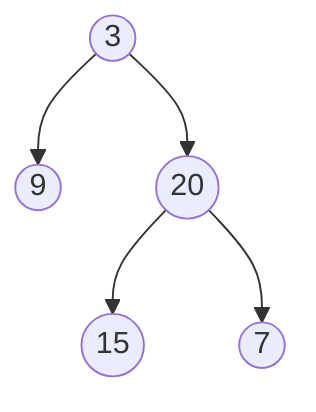

## Descripción

Dado el nodo `root` de un árbol binario, devuelve su profundidad máxima.

La **profundidad máxima** de un árbol binario es el número de nodos del camino más largo desde la raiz hasta las hojas del árbol.

Ejemplo de árbol binario:

La profundidad máxima de este arbol es 3.

## Solución

Existen dos enfoques principales para resolver este problema:

1. **Solución Recursiva (DFS)**:
   - Recursivamente calcular la profundidad máxima de los subárboles izquierdo y derecho.
   - Devolver el máximo de estas profundidades más uno (para contar el nodo actual).

2. **Solución Iterativa (BFS)**:
   - Usar una cola para realizar un recorrido por niveles del árbol.
   - Incrementar un contador de nivel en cada iteración.
   - El último nivel procesado será la profundidad máxima.

Esta implementación tiene una complejidad de tiempo O(n)

## Enlaces

* [Problema original en LeetCode](https://leetcode.com/problems/maximum-depth-of-binary-tree/)
* [Código de la solución en Github](https://github.com/cdgn-coding/leetcode-practice-guide/blob/main/binary_tree/max_depth/index.md)