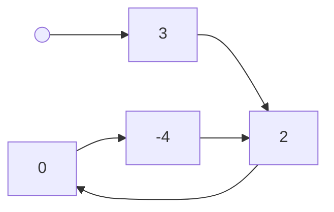

## Descripción

Se te da `head`, la cabeza de una lista enlazada. Determina si la lista enlazada tiene un ciclo en ella.

Hay un ciclo en una lista enlazada si hay algún nodo en la lista que puede ser alcanzado nuevamente siguiendo continuamente el puntero next. Internamente, `pos` se usa para denotar el índice del nodo al que está conectado el puntero next del último nodo. Ten en cuenta que `pos` no se pasa como parámetro.

Devuelve `true` si hay un ciclo en la lista enlazada. De lo contrario, devuelve `false`.

¿Puedes resolverlo usando $O(1)$ (es decir, constante) memoria?

**Entrada**

**Salida**

`true`

**Explicación**

Hay un ciclo en la lista enlazada, donde la cola se conecta al segundo nodo (índice 1).

## Solución

Para resolver este problema de manera eficiente y con memoria constante, podemos utilizar el algoritmo de Floyd (también conocido como algoritmo de la tortuga y la liebre):

1. Inicializamos dos punteros, `slow` y `fast`, ambos apuntando a la cabeza de la lista.

2. Movemos `slow` un paso a la vez y `fast` dos pasos a la vez.

3. Si hay un ciclo, eventualmente `slow` y `fast` se encontrarán en el mismo nodo.

4. Si `fast` llega al final de la lista (es decir, `fast` o `fast.next` es `null`), no hay ciclo.

Este enfoque tiene una complejidad temporal de $O(n)$ y una complejidad espacial de $O(1)$.

## Enlaces

* [Problema original en LeetCode](https://leetcode.com/problems/linked-list-cycle/)
* [Código de la solución en Github](https://github.com/cdgn-coding/leetcode-practice-guide/blob/main/linked_lists/linked_list_cycle/linked_list_cycle.py)